# 📚 Koatendance - QR Code Attendance System

<div align="center">

**A modern, innovative attendance management system with QR code scanning, integrated grading, and automated guardian alerts.**

[](https://laravel.com)
[](https://vuejs.org)
[](https://inertiajs.com)
[](https://php.net)

</div>

---

## 📋 Table of Contents

- [Overview](#-overview)
- [Tech Stack](#-tech-stack)
- [Key Features](#-key-features)
- [System Architecture](#-system-architecture)
- [Database Schema](#-database-schema)
- [Data Flow](#-data-flow)
- [API Reference](#-api-reference)
- [Installation](#-installation)
- [Configuration](#-configuration)
- [Testing](#-testing)
- [License](#-license)

---

## 🎯 Overview

Koatendance is a comprehensive attendance management system designed for educational institutions. The system streamlines attendance tracking through QR code technology where **teachers scan student QR codes** during class sessions. 

### Core Capabilities

- **QR Code Attendance**: Each student has a unique, encrypted QR code that teachers scan
- **Integrated Grading**: Complete grading system with multiple assessment types
- **Seat Plan Management**: Dynamic seating arrangements with visual layouts
- **Automated Alerts**: Guardian notifications for absences via email
- **Analytics Dashboard**: Real-time insights into attendance patterns and academic performance
- **Multi-Role Support**: Admin, Teacher, Student, and Guardian roles

---

## 🛠 Tech Stack

| Category | Technology |
|----------|-----------|
| **Backend** | PHP 8.5 + Laravel 12 |
| **Frontend** | Vue 3 + Inertia.js v2 |
| **Styling** | Tailwind CSS v4 |
| **Authentication** | Laravel Fortify (2FA support) |
| **Database** | SQLite (configurable) |
| **Testing** | Pest v4 |

---

## ✨ Key Features

### 1. QR Code-Based Attendance

- **Student QR Codes**: Each student receives a unique, encrypted QR code containing their ID
- **Teacher Scanning**: Teachers use their device camera to scan student QR codes
- **Real-time Validation**: Instant verification of student identity and enrollment
- **Duplicate Prevention**: System blocks multiple scans in the same session
- **Manual Override**: Teachers can manually adjust attendance records

### 2. Automated Guardian Alerts

- **Smart Detection**: Multiple alert rules (threshold, consecutive, pattern-based)
- **Email Notifications**: Automatic emails to guardians when students are absent
- **Customizable Preferences**: Guardians control notification frequency and channels
- **Alert History**: Complete audit trail of all notifications sent

### 3. Comprehensive Grading System

- **Multi-type Assessments**: Assignments, quizzes, exams, projects, participation
- **Weighted Grading**: Configurable weights for different assessment types
- **Letter Grades**: Automatic conversion using customizable grade scales
- **GPA Calculation**: Real-time GPA tracking for students
- **Teacher Feedback**: Detailed feedback attached to each grade entry

### 4. Advanced Analytics

- **Student Analytics**: Attendance rates, grade trends, absence patterns
- **Section Analytics**: Class performance, at-risk student identification
- **Institutional Insights**: Grade distribution, course popularity, effectiveness metrics

---

## 🏗 System Architecture

### User Role Hierarchy

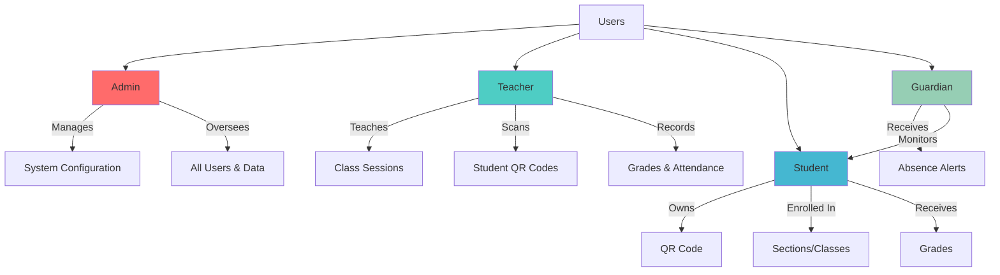

### Core System Components

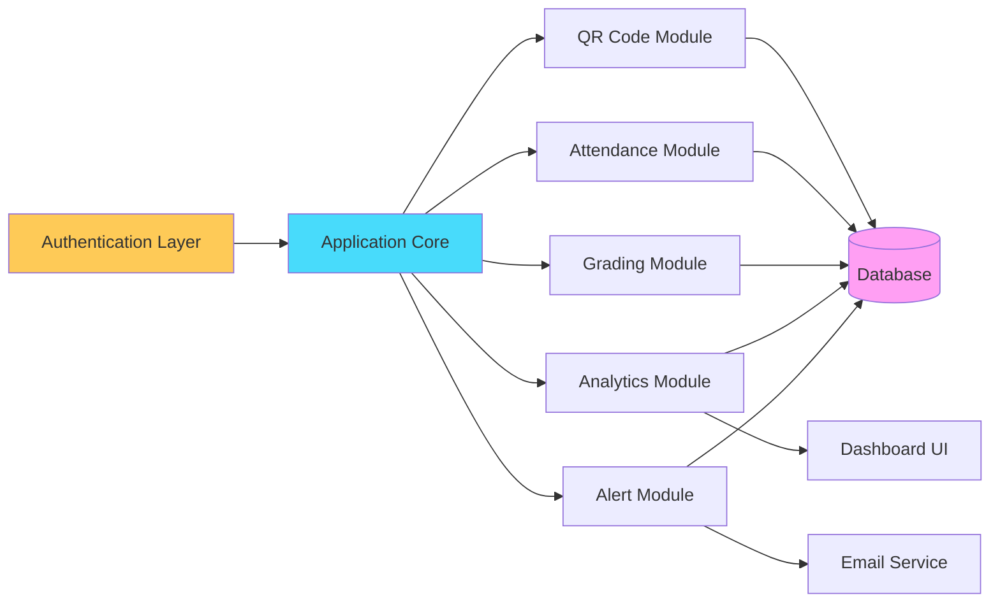

---

## 🗄 Database Schema

### Entity Relationship Overview

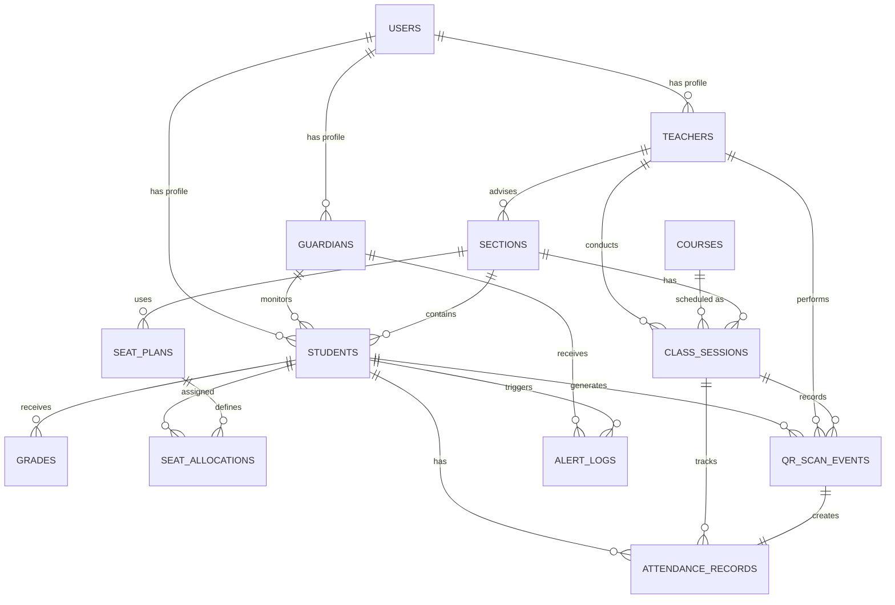

### Core Models

#### 👤 User Model

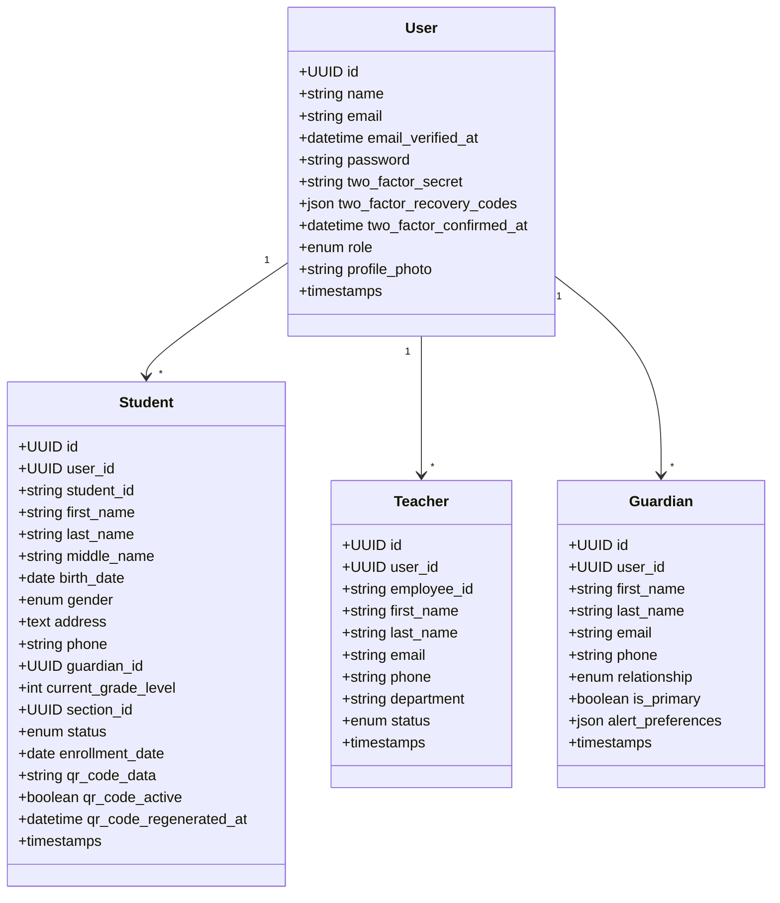

#### 📚 Academic Models

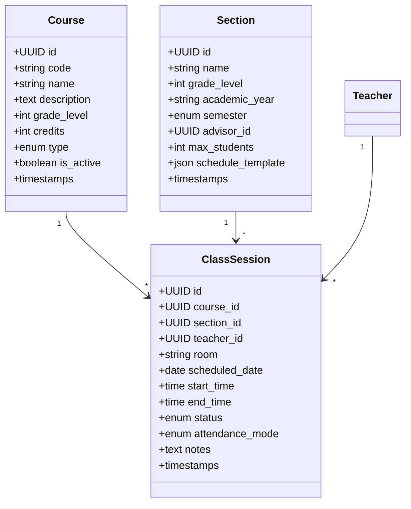

#### ✅ Attendance System

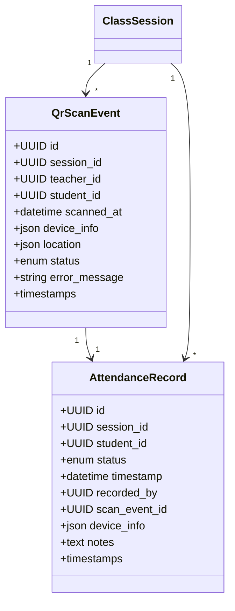

#### 📊 Grading System

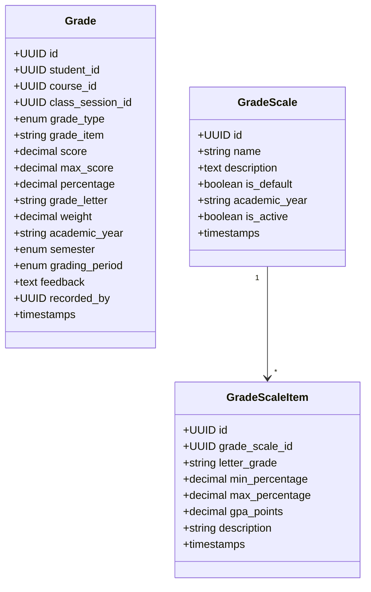

#### 🔔 Alert System

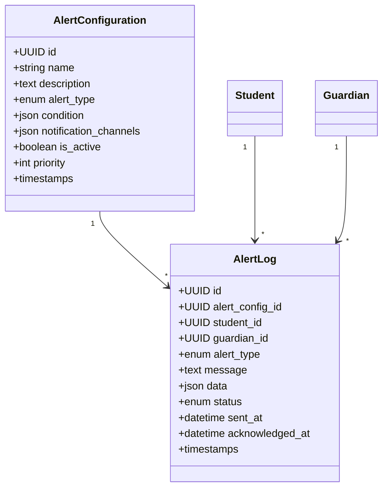

### Field Descriptions

<details>
<summary><b>User Role Types</b></summary>

| Role | Description |
|------|-------------|
| `admin` | Full system access, manages all users and configurations |
| `teacher` | Conducts classes, scans QR codes, records grades |
| `student` | Owns QR code, enrolled in sections, receives grades |
| `guardian` | Receives alerts, monitors student(s) |

</details>

<details>
<summary><b>Attendance Status Types</b></summary>

| Status | Description |
|--------|-------------|
| `present` | Student attended the class |
| `absent` | Student did not attend |
| `late` | Student arrived after threshold time |
| `excused` | Absence is excused with reason |
| `early_departure` | Student left before class ended |

</details>

<details>
<summary><b>Class Session Status</b></summary>

| Status | Description |
|--------|-------------|
| `scheduled` | Class is scheduled but not started |
| `in_progress` | Class is currently ongoing |
| `completed` | Class has finished |
| `cancelled` | Class was cancelled |
| `makeup` | Makeup class for missed session |

</details>

<details>
<summary><b>Grade Types</b></summary>

| Type | Description |
|------|-------------|
| `assignment` | Regular assignment |
| `quiz` | Short assessment |
| `exam` | Major examination |
| `project` | Long-term project |
| `participation` | Class participation score |
| `final` | Final grade for the course |

</details>

<details>
<summary><b>Alert Types</b></summary>

| Type | Description |
|------|-------------|
| `absence_threshold` | Alert after X absences |
| `consecutive_absence` | Alert for consecutive absences |
| `pattern_detected` | Unusual attendance pattern |
| `daily_digest` | Daily summary of absences |

</details>

---

## 🔄 Data Flow

### QR Code Attendance Workflow

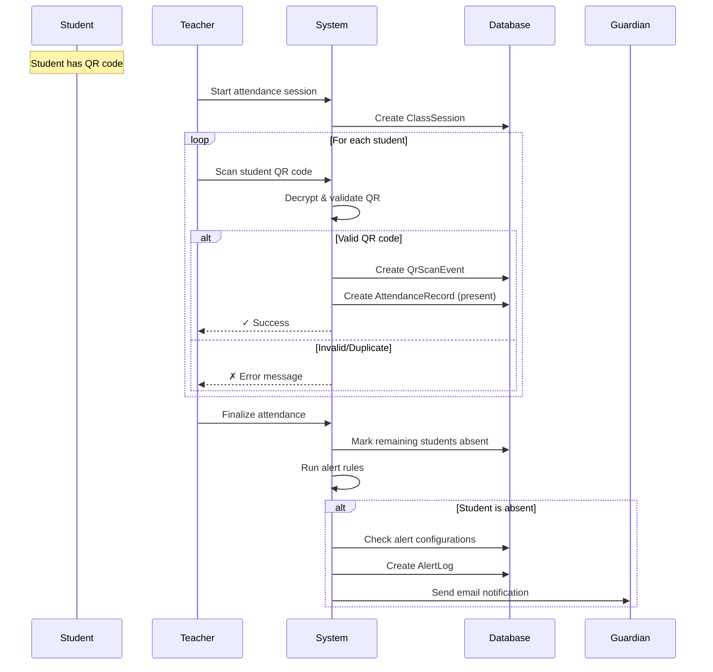

### Grading Workflow

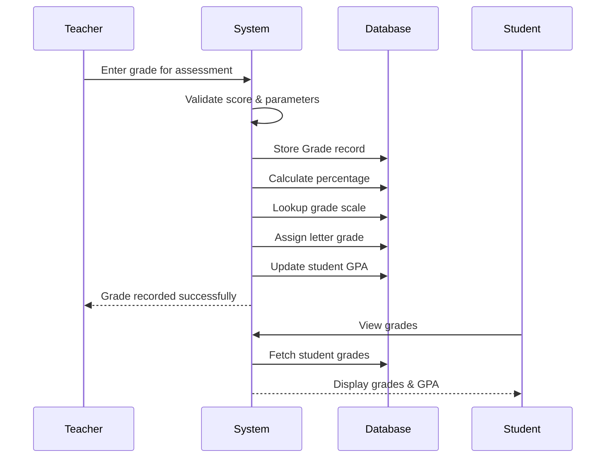

### Alert System Workflow

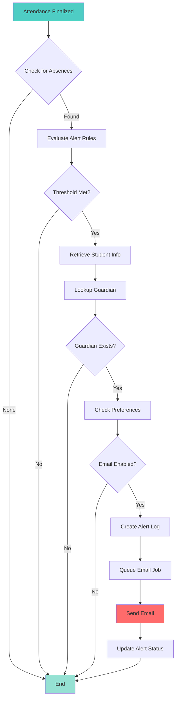

---

## 🌐 API Reference

### Authentication Endpoints

| Method | Endpoint | Description |
|--------|----------|-------------|
| POST | `/login` | User login with credentials |
| POST | `/logout` | User logout |
| POST | `/register` | New user registration |

### Attendance Management

| Method | Endpoint | Description |
|--------|----------|-------------|
| GET | `/api/attendance/sessions` | List all class sessions |
| POST | `/api/attendance/sessions` | Create new session |
| GET | `/api/attendance/sessions/{id}` | Get session details |
| POST | `/api/attendance/sessions/{id}/start` | Start attendance taking |
| GET | `/api/attendance/sessions/{id}/students` | List enrolled students |
| GET | `/api/attendance/sessions/{id}/scanned` | List scanned students |
| GET | `/api/attendance/sessions/{id}/pending` | List pending students |
| POST | `/api/attendance/scan` | Scan student QR code |
| GET | `/api/attendance/records/{sessionId}` | Get attendance records |
| PUT | `/api/attendance/records/{id}` | Update attendance record |
| POST | `/api/attendance/records/{id}/finalize` | Finalize and mark absences |

### QR Code Management

| Method | Endpoint | Description |
|--------|----------|-------------|
| GET | `/api/students/{id}/qr-code` | Get QR code image |
| POST | `/api/students/{id}/regenerate-qr` | Regenerate QR code |
| GET | `/api/students/{id}/qr-code-data` | Get raw QR data |

### Grading System

| Method | Endpoint | Description |
|--------|----------|-------------|
| GET | `/api/grades/student/{studentId}` | Get student grades |
| GET | `/api/grades/course/{courseId}` | Get course grades |
| POST | `/api/grades` | Create grade entry |
| PUT | `/api/grades/{id}` | Update grade |
| GET | `/api/grades/transcript/{studentId}` | Generate transcript |

### Seat Plan Management

| Method | Endpoint | Description |
|--------|----------|-------------|
| GET | `/api/seat-plans/section/{sectionId}` | Get section seat plans |
| POST | `/api/seat-plans` | Create seat plan |
| PUT | `/api/seat-plans/{id}` | Update seat plan |
| POST | `/api/seat-allocations` | Assign seats |
| GET | `/api/seat-allocations/session/{sessionId}` | Get session seating |

### Analytics & Reporting

| Method | Endpoint | Description |
|--------|----------|-------------|
| GET | `/api/analytics/dashboard` | Dashboard overview data |
| GET | `/api/analytics/student/{studentId}` | Student analytics |
| GET | `/api/analytics/section/{sectionId}` | Section analytics |
| GET | `/api/analytics/attendance-trends` | Attendance trends |
| GET | `/api/analytics/grade-distribution` | Grade distribution |

### Alert Configuration

| Method | Endpoint | Description |
|--------|----------|-------------|
| GET | `/api/alerts/configurations` | List alert configs |
| POST | `/api/alerts/configurations` | Create alert config |
| GET | `/api/alerts/logs/student/{studentId}` | Student alert history |

---

## 📦 Installation

### Prerequisites

- PHP 8.5 or higher
- Composer
- Node.js 18+ and NPM
- SQLite (or preferred database)

### Setup Steps

```bash
# 1. Clone the repository
git clone <repository-url>
cd Koatendance

# 2. Install PHP dependencies
composer install

# 3. Install NPM dependencies
npm install

# 4. Configure environment
cp .env.example .env

# 5. Generate application key
php artisan key:generate

# 6. Run database migrations
php artisan migrate

# 7. (Optional) Seed the database with sample data
php artisan db:seed

# 8. Build frontend assets
npm run build

# 9. Start development server
composer run dev
```

### Development Mode

```bash
# Terminal 1: Start Laravel development server
php artisan serve

# Terminal 2: Start Vite dev server for hot reloading
npm run dev

# Terminal 3: Start queue worker for jobs
php artisan queue:work

# Terminal 4: Start scheduler for automated tasks
php artisan schedule:work
```

---

## ⚙️ Configuration

### Environment Variables

Create a `.env` file with the following key configurations:

```env
# Application
APP_NAME=Koatendance
APP_ENV=local
APP_URL=http://localhost
APP_DEBUG=true

# Database
DB_CONNECTION=sqlite
# DB_DATABASE=/absolute/path/to/database.sqlite

# Mail Configuration (for alerts)
MAIL_MAILER=smtp
MAIL_HOST=smtp.example.com
MAIL_PORT=587
MAIL_USERNAME=your-email@example.com
MAIL_PASSWORD=your-password
MAIL_ENCRYPTION=tls
MAIL_FROM_ADDRESS=alerts@koatendance.com
MAIL_FROM_NAME="${APP_NAME}"

# QR Code Settings
QR_CODE_REGENERATION_DAYS=90
QR_CODE_ENCRYPTION_KEY="${APP_KEY}"

# Attendance Settings
ATTENDANCE_LATE_THRESHOLD_MINUTES=15
ATTENDANCE_AUTO_FINALIZE=true

# Alert Settings
ABSENT_ALERT_ENABLED=true
ALERT_THRESHOLD_DEFAULT=3
ALERT_CONSECUTIVE_DEFAULT=2
```

### Alert Configuration Options

| Setting | Default | Description |
|---------|---------|-------------|
| `ABSENT_ALERT_ENABLED` | `true` | Enable/disable alert system |
| `ALERT_THRESHOLD_DEFAULT` | `3` | Default absence count for alerts |
| `ALERT_CONSECUTIVE_DEFAULT` | `2` | Default consecutive absences for alerts |

### Queue Configuration

The system uses Laravel queues for:
- Email notifications
- Analytics calculations
- Report generation

Ensure your queue worker is running:

```bash
php artisan queue:work --tries=3
```

---

## 🧪 Testing

### Running Tests

```bash
# Run all tests
php artisan test

# Run with compact output
php artisan test --compact

# Run specific test suite
php artisan test --testsuite=Feature

# Run specific test file
php artisan test tests/Feature/AttendanceTest.php

# Run with coverage report
php artisan test --coverage

# Run with minimum coverage threshold
php artisan test --coverage --min=80
```

### Test Structure

```
tests/
├── Feature/
│   ├── AttendanceTest.php
│   ├── GradingTest.php
│   ├── QrCodeTest.php
│   └── AlertTest.php
└── Unit/
    ├── Models/
    ├── Services/
    └── Helpers/
```

---

## 📄 License

This project is licensed under the MIT License. See the [LICENSE](LICENSE) file for details.

---

## 🤝 Contributing

Contributions are welcome! Please feel free to submit a Pull Request.

---

## 📞 Support

For issues, questions, or suggestions, please open an issue on the repository.

---

<div align="center">

**Built with ❤️ using Laravel, Vue, and Inertia.js**

</div>
